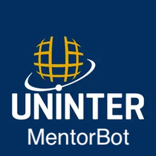

# 👋 Boas Vindas ao MentorBot

---

## Sobre o Bot

O **MentorBot** foi criado para tornar a rotina de monitores e estudantes da Uninter mais prática, organizada e acessível no Discord!

---

## ✨ Por que esse Bot existe?

Olá! Me chamo **Chris**, integrante da Monitoria 2025 da Uninter e estudante do curso de **Análise e Desenvolvimento de Sistemas**. O MentorBot surgiu como meu projeto da **Atividade Extensionista**, e também para atender à necessidade de um espaço centralizado para organizar contatos, comandos, grupos e informações úteis para todos.

---

## 💡 O que o MentorBot faz?

- **Centraliza informações** importantes de contato, grupos e suporte oficial.
- **Facilita o dia a dia** de monitores, automatizando respostas e notificações.
- **Oferece comandos rápidos** para acessar referências e guias.
- **Protege dados e permissões**, garantindo que apenas quem deve tem acesso a comandos sensíveis.
- **Aprimora a experiência** sem substituir a interação humana.

---

## 🚀 Características principais

- Comandos intuitivos (`/contato`, `/definir`, `/referencias`, etc)
- Notificações por DM sobre dúvidas novas
- Guia de comandos para alunos e monitores

---

✨ Explore os comandos e aproveite ao máximo o MentorBot no Discord da Uninter! ✨

